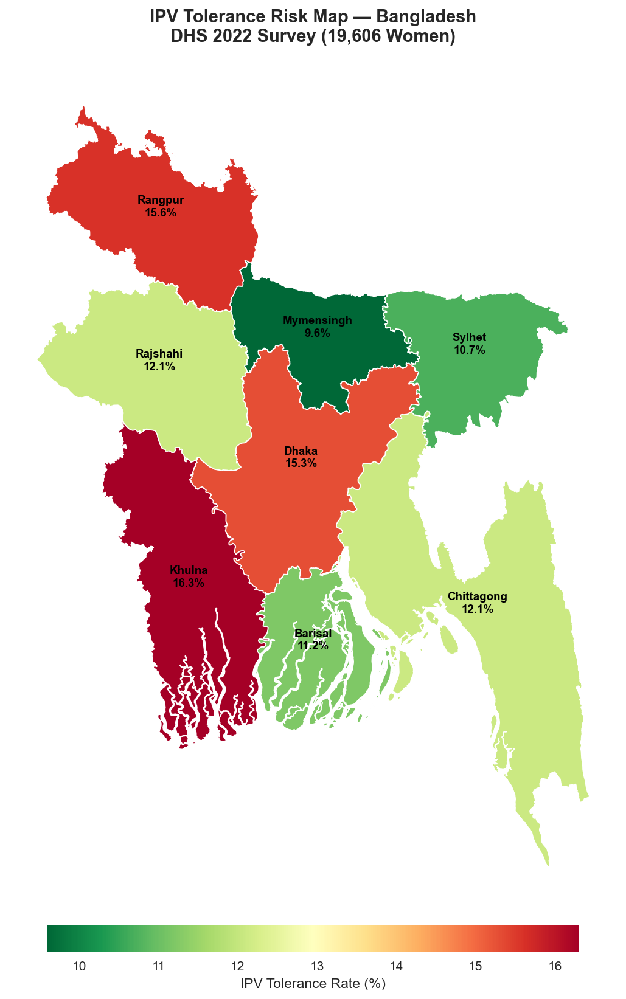
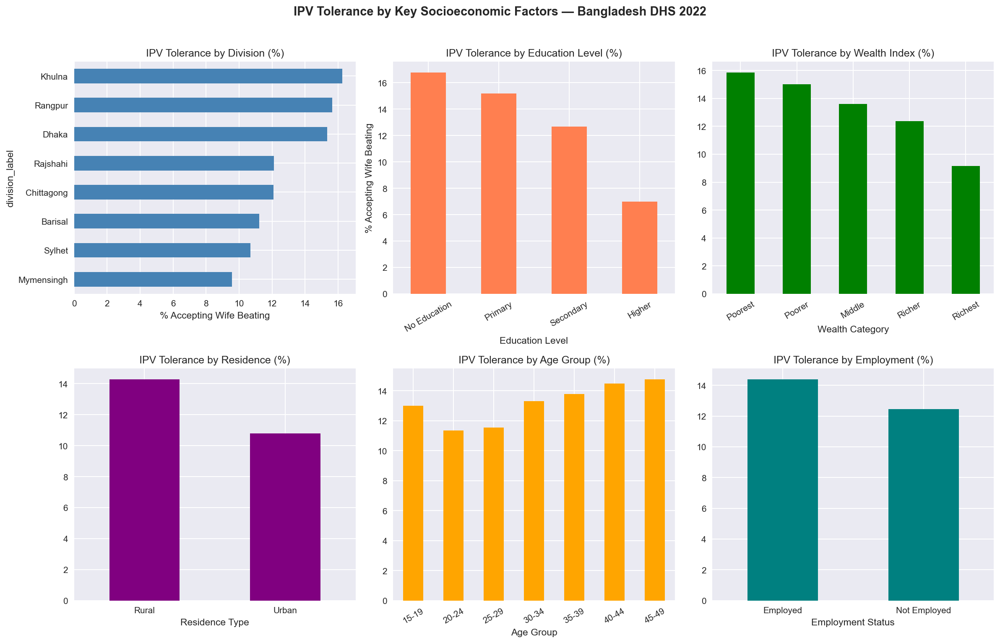
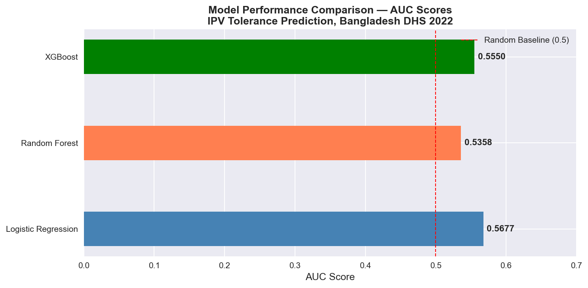
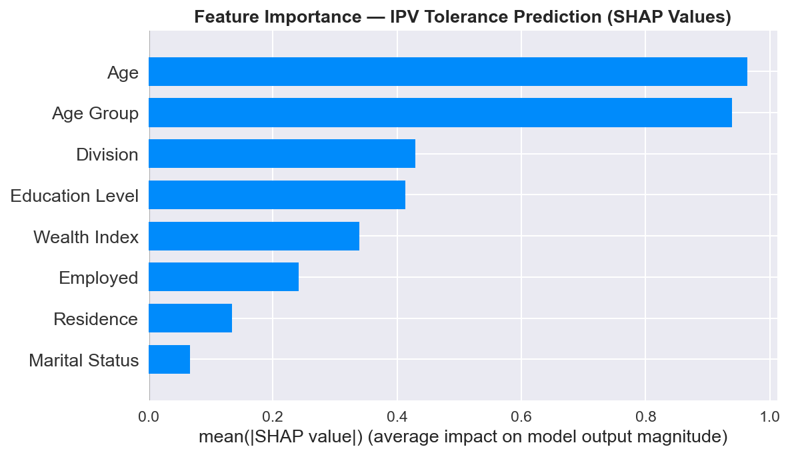

# 📊 Violence Against Women (VAW) Analytics System — Bangladesh


An end-to-end machine learning and data analytics project analyzing **intimate partner violence (IPV) tolerance** among women in Bangladesh, using the **Bangladesh Demographic and Health Survey (DHS) 2022** microdata (19,606 respondents). The project applies classification models, SHAP explainability, and geospatial visualization to uncover which socioeconomic factors drive IPV acceptance across Bangladesh's 8 administrative divisions.

---

## 🔑 Key Findings at a Glance

| Insight | Finding |
|--------|---------|
| Overall IPV tolerance rate | **13.1%** of women accept wife beating |
| Highest risk division | **Khulna — 16.3%** |
| Lowest risk division | **Mymensingh — 9.6%** |
| Education impact | No education **(17%)** vs Higher education **(7%)** — 59% reduction |
| Wealth impact | Poorest **(15.9%)** vs Richest **(9.3%)** — 41% reduction |
| Residence gap | Rural **(14.1%)** vs Urban **(10.9%)** |
| Strongest predictor | **Age** (confirmed by SHAP analysis) |
| Best model AUC | **Logistic Regression — 0.5677** |

---

## 🗺️ Division-wise IPV Risk Map



> Choropleth map showing IPV tolerance rates across all 8 divisions of Bangladesh. Khulna and Rangpur emerge as highest-risk regions, while Mymensingh shows the lowest tolerance rate.

---

## 📊 EDA — IPV Tolerance by Socioeconomic Factors



> Six-panel chart showing IPV tolerance breakdown by division, education level, wealth index, residence type, age group, and employment status.

---

## 🤖 ML Model Performance



> All three models outperform the random baseline (AUC = 0.50). The modest AUC scores are themselves a finding — socioeconomic factors alone have limited predictive power, suggesting cultural and social norms play a significant role in IPV tolerance.

---

## 🔍 SHAP Feature Importance



> SHAP analysis reveals **Age** as the strongest predictor, followed by **Division** (regional culture) and **Education Level**. Marital status has the least impact.

---

## 🎯 Project Objectives

- Predict IPV tolerance across demographic and geographic segments in Bangladesh
- Identify the strongest socioeconomic risk factors using SHAP explainability
- Visualize division-wise risk distribution across Bangladesh's 8 administrative divisions
- Provide interpretable, policy-relevant insights for researchers and NGOs

---

## 📁 Project Structure

```
VAW-Analytics-System/
│
├── data/
│   ├── raw/                  # DHS 2022 raw dataset (not included — see Data Access)
│   ├── processed/            # Cleaned and feature-engineered dataset
│   └── external/             # BBS/UNFPA 2024 aggregated statistics
│
├── notebooks/
│   └── VAW_Analytics_Bangladesh_DHS2022.ipynb  # Main analysis notebook
│
├── reports/
│   └── figures/
│       ├── bangladesh_ipv_risk_map.png      # Division choropleth map
│       ├── ipv_tolerance_analysis.png       # EDA charts
│       ├── model_comparison.png             # Model AUC comparison
│       └── shap_importance.png              # SHAP feature importance
│
├── DATA_ACCESS.md            # How to access the DHS dataset
├── .gitignore                # Excludes raw data per DHS policy
├── requirements.txt
└── README.md
```

---

## 🧠 Methodology

### 1. Data & Target Variable
- **Source:** Bangladesh DHS 2022 — 19,606 women aged 15–49
- **Target:** Binary IPV tolerance score derived from v744a–v744e (wife beating attitude variables)
- **Definition:** 1 = accepts wife beating for at least one reason, 0 = never accepts

### 2. Exploratory Data Analysis
- IPV tolerance breakdown by division, education, wealth, age group, residence, employment
- Clear negative correlation between education/wealth and IPV tolerance

### 3. Data Preprocessing
- SMOTE applied to handle 6.7:1 class imbalance
- Missing husband-related features filled with median
- 80/20 train-test split with stratification

### 4. Machine Learning Models

| Model | AUC Score |
|-------|-----------|
| Logistic Regression | **0.5677** ← Best |
| XGBoost | 0.5550 |
| Random Forest | 0.5358 |

### 5. SHAP Explainability
- TreeExplainer applied to XGBoost model
- Top features: Age → Division → Education → Wealth Index → Employment

### 6. Geospatial Risk Mapping
- Division-level IPV tolerance rates calculated from survey data
- Bangladesh administrative boundaries sourced from GADM
- Choropleth map visualizing regional risk distribution

---

## 🛠️ Tech Stack

| Category | Tools |
|----------|-------|
| Language | Python 3.14 |
| Data Processing | Pandas, NumPy |
| Machine Learning | Scikit-learn, XGBoost |
| Class Balancing | imbalanced-learn (SMOTE) |
| Explainability | SHAP |
| Visualization | Matplotlib, Seaborn |
| Geospatial | GeoPandas |
| Environment | Jupyter Notebook |
| Version Control | Git, GitHub |

---

## ⚙️ Installation & Setup

```bash
# Clone the repository
git clone https://github.com/shoibaldas/VAW-Analytics-System.git
cd VAW-Analytics-System

# Create virtual environment
python -m venv venv
venv\Scripts\activate      # Windows
# source venv/bin/activate  # Mac/Linux

# Install dependencies
pip install -r requirements.txt

# Get the dataset (see DATA_ACCESS.md)
# Place DTA file in data/raw/BDIR81DT/

# Launch Jupyter Notebook
jupyter notebook
```

---

## 🗂️ Data Access

The raw DHS 2022 dataset is **not included** in this repository due to the DHS Program Data Use Agreement. See [DATA_ACCESS.md](DATA_ACCESS.md) for instructions on how to obtain the dataset for free.

---

## 📜 Ethics & Data Usage

- DHS 2022 data used strictly for academic research per the [DHS Data Use Agreement](https://dhsprogram.com/data/terms-of-use.cfm)
- No individual-level raw data is shared in this repository
- No attempt to identify or profile individual respondents
- Findings intended for evidence-based policy and research only

---

## 🔗 References

- ICF. *Bangladesh Demographic and Health Survey 2022*. DHS Program. [Link](https://dhsprogram.com)
- BBS & UNFPA. *Violence Against Women Survey 2024*. [Link](https://bangladesh.unfpa.org/en/2024-violence-against-women-survey)
- WHO. *Violence against women prevalence estimates, 2018*. [Link](https://www.who.int/publications/i/item/9789240022256)
- Lundberg & Lee. *A Unified Approach to Interpreting Model Predictions (SHAP)*. NeurIPS 2017.