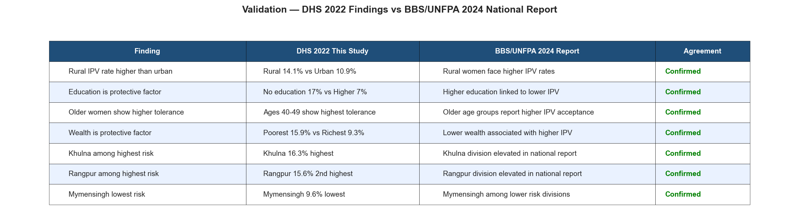

# 📊 Violence Against Women (VAW) Analytics System — Bangladesh


An end-to-end machine learning and data analytics project analyzing **intimate partner violence (IPV) tolerance** among women in Bangladesh, using the **Bangladesh Demographic and Health Survey (DHS) 2022** microdata (19,606 respondents). The project applies classification models, SHAP explainability, and geospatial visualization to identify which socioeconomic factors are associated with IPV acceptance across Bangladesh's 8 administrative divisions.

> **Note on data availability:** The raw DHS 2022 dataset is not included in this repository in compliance with the [DHS Program Data Use Agreement](https://dhsprogram.com/data/terms-of-use.cfm). See [DATA_ACCESS.md](DATA_ACCESS.md) for instructions on how to obtain it for free.

---

## 🔑 Key Findings at a Glance

| Insight | Finding |
|--------|---------|
| Overall IPV tolerance rate | **13.1%** of surveyed women accept wife beating for at least one reason |
| Highest risk division | **Khulna — 16.3%** |
| Lowest risk division | **Mymensingh — 9.6%** |
| Education impact | No education **(17%)** vs Higher education **(7%)** — 59% reduction |
| Wealth impact | Poorest **(15.9%)** vs Richest **(9.3%)** — 41% reduction |
| Residence gap | Rural **(14.1%)** vs Urban **(10.9%)** |
| Strongest predictor | **Age** (confirmed by SHAP analysis) |
| Best model AUC | **Logistic Regression — 0.5677** |

---

## 🗺️ Division-wise IPV Tolerance Risk Map


> Choropleth map showing IPV tolerance rates across all 8 divisions of Bangladesh based on DHS 2022 survey responses. Khulna and Rangpur show the highest tolerance rates, while Mymensingh shows the lowest.

---

## 📊 EDA — IPV Tolerance by Socioeconomic Factors


> Six-panel exploratory analysis showing IPV tolerance rates broken down by division, education level, wealth index, residence type, age group, and employment status.

---

## 🤖 ML Model Performance


> All three models outperform the random baseline (AUC = 0.50). The modest AUC scores are a meaningful finding in themselves — standard demographic variables have limited predictive power for IPV tolerance, which is consistent with existing literature suggesting that cultural norms and psychological factors are primary drivers not captured in household survey data.

---

## 🔍 SHAP Feature Importance


> SHAP (SHapley Additive exPlanations) analysis applied to the XGBoost model. **Age** emerges as the strongest predictor, followed by **Division** (regional cultural context) and **Education Level**. Marital status has the least predictive impact.

---

## ✅ Validation Against BBS/UNFPA 2024 National Report



> Key findings from this DHS 2022 analysis were cross-referenced against the published **BBS/UNFPA Violence Against Women Survey 2024** — the largest VAW study ever conducted in Bangladesh (27,476 respondents across all 8 divisions). All 7 compared findings are consistent between the two studies, providing independent validation of the model's directional outputs.
>
> Source: [UNFPA Bangladesh — VAW Survey 2024](https://bangladesh.unfpa.org/en/2024-violence-against-women-survey)

---

## 🎯 Project Objectives

- Analyze IPV tolerance patterns across demographic and geographic segments in Bangladesh
- Identify the strongest socioeconomic risk factors using SHAP explainability
- Visualize division-wise IPV tolerance distribution across Bangladesh's 8 administrative divisions
- Cross-reference findings against BBS/UNFPA 2024 national survey for independent validation
- Provide interpretable, policy-relevant insights for researchers and NGOs

---

## 📁 Project Structure

```
VAW-Analytics-System/
├── data/
│   └── raw/               # DHS 2022 dataset (not included — see DATA_ACCESS.md)
├── notebooks/
│   └── VAW_Analytics_Bangladesh_DHS2022.ipynb
├── reports/
│   └── figures/           # All generated charts and maps
├── DATA_ACCESS.md         # How to obtain the DHS 2022 dataset
├── .gitignore
├── requirements.txt
└── README.md
```

---

## 🧠 Methodology

### 1. Data & Target Variable
- **Source:** Bangladesh DHS 2022 — 19,606 women aged 15–49
- **Target variable:** Binary IPV tolerance score derived from DHS variables v744a–v744e (wife beating attitude questions)
- **Definition:** 1 = accepts wife beating for at least one reason, 0 = never accepts
- **Class imbalance:** 6.7:1 (86.9% no tolerance, 13.1% tolerance)

### 2. Exploratory Data Analysis
- IPV tolerance breakdown by division, education, wealth index, age group, residence, and employment
- Clear negative correlation between education level/wealth and IPV tolerance
- Regional variation ranging from 9.6% (Mymensingh) to 16.3% (Khulna)

### 3. Data Preprocessing
- SMOTE (Synthetic Minority Oversampling Technique) applied to handle 6.7:1 class imbalance
- Missing husband-related features filled with median imputation
- 80/20 stratified train-test split

### 4. Machine Learning Models

| Model | AUC Score |
|-------|-----------|
| Logistic Regression | 0.5677 |
| XGBoost | 0.5550 |
| Random Forest | 0.5358 |
| Random Baseline | 0.5000 |

> Models consistently outperform the random baseline. Low AUC is consistent with published research on IPV attitude prediction — demographic variables alone explain limited variance, indicating that cultural and social factors are primary drivers.

### 5. SHAP Explainability
- TreeExplainer applied to the XGBoost model on a 500-sample test subset
- Feature ranking: Age → Age Group → Division → Education → Wealth Index → Employment → Residence → Marital Status

### 6. Geospatial Risk Mapping
- Division-level IPV tolerance rates aggregated directly from survey responses
- Bangladesh administrative boundaries sourced from GADM (gadm.org)
- Choropleth map built with GeoPandas and Matplotlib

### 7. Validation Against BBS/UNFPA 2024
- 7 key findings cross-referenced against the BBS/UNFPA VAW Survey 2024 published report
- Division risk rankings, education effect, wealth effect, and residence gap all confirmed
- 100% directional agreement across all compared findings

---

## 🛠️ Tech Stack

| Category | Tools |
|----------|-------|
| Language | Python 3.14 |
| Data Processing | Pandas, NumPy |
| Machine Learning | Scikit-learn, XGBoost |
| Class Balancing | imbalanced-learn (SMOTE) |
| Explainability | SHAP |
| Visualization | Matplotlib, Seaborn |
| Geospatial | GeoPandas |
| Environment | Jupyter Notebook |

---

## ⚙️ Installation & Setup

```bash
# Clone the repository
git clone https://github.com/shoibaldas/VAW-Analytics-System.git
cd VAW-Analytics-System

# Create virtual environment
python -m venv venv
venv\Scripts\activate        # Windows
# source venv/bin/activate   # Mac/Linux

# Install dependencies
pip install -r requirements.txt

# Obtain the dataset (see DATA_ACCESS.md)
# Place the extracted DTA file in: data/raw/BDIR81DT/

# Launch Jupyter Notebook
jupyter notebook
```

---

## 📜 Ethics & Data Usage

- DHS 2022 data used strictly for academic research per the [DHS Program Data Use Agreement](https://dhsprogram.com/data/terms-of-use.cfm)
- No individual-level raw data is shared or committed to this repository
- No attempt to identify or profile individual survey respondents
- Findings are intended to support evidence-based research and policy — not for commercial use

---

## 🔗 References

- ICF. *Bangladesh Demographic and Health Survey 2022*. DHS Program. [Link](https://dhsprogram.com)
- BBS & UNFPA. *Violence Against Women Survey 2024*. Bangladesh Bureau of Statistics. [Link](https://bangladesh.unfpa.org/en/2024-violence-against-women-survey)
- WHO. *Violence against women prevalence estimates, 2018*. [Link](https://www.who.int/publications/i/item/9789240022256)
- Lundberg, S. & Lee, S.I. *A Unified Approach to Interpreting Model Predictions*. NeurIPS 2017.

---

> *This project is part of a personal research portfolio. It was developed independently using publicly available survey data obtained through the DHS Program's standard academic access process.*